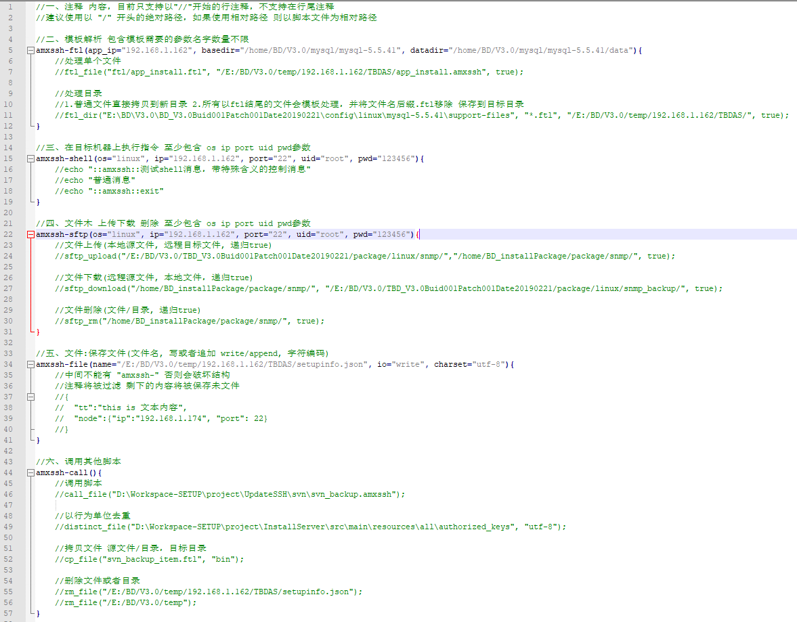
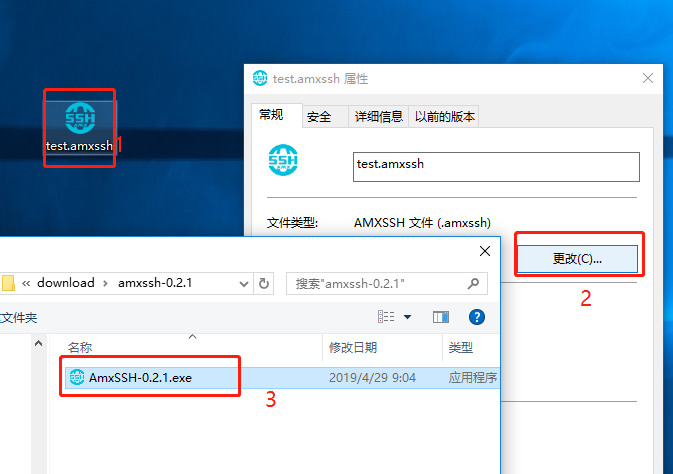

# AmxSSH 

```
项目AmxSSH定义了一个轻量级的远程操作脚本语言，提供了一种脚本操作远程的途径。

基于SSH,SFTP,FTL,JSON等相关技术，可以巧妙的操作windows、Linux系统，进而减少重复劳动。
```

## 一、[语言定义](amxssh/readme.md "语言定义")




## 二、使用方法

### 2.1 下载脚本解析器: [AmxSSH-0.2.1.exe](download/amxssh-0.2.1/AmxSSH-0.2.1.exe "AmxSSH-0.2.1.exe")

文件路径：download/amxssh-0.2.1/AmxSSH-0.2.1.exe

 

### 2.2 新建脚本文件 test`.amxssh`, 关联脚本执行程序, 后续双击执行。



## 三、使用示例

### 3.1 [shutdown](project/shutdown/readme.md "批量关机")
项目路径: project/shutdown

```
shutdown_0.amxssh 脚本文件
shutdown_pcs.amxssh.ftl 模板文件
shutdown_pcs.json 配置文件
```

### 3.2 [svnbackup](project/svnbackup/readme.md "svn增量备份")
项目路径: project/svnbackup

```
svn_backup.amxssh 脚本文件
svn_backup.ftl 主模板文件
svn_backup.json 配置文件

svn_backup_item.ftl 辅助模板
```
